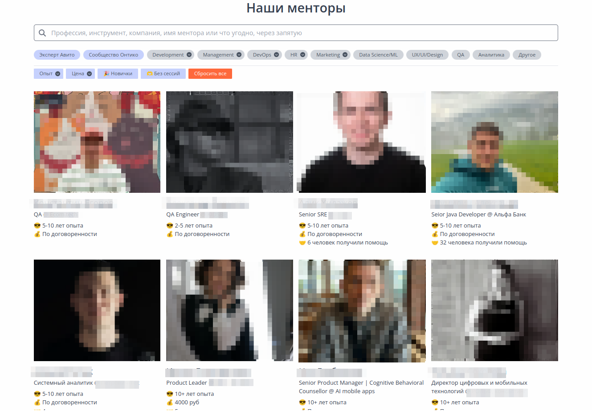

# Список проектов для участия

Список проектов, в которых можно принять участие и получить коммерческий опыт.

## Как помочь?

Мы принимаем Pull Request'ы! В качестве примера описания проекта — смотрите Code Basics

### Правила

* Добавьте описание проекта, которому требуется помощь, как принять участие, контактные данные для связи. Используйте для шаблона Code Basics.

## Проекты

|Название | Code Basics |
|:----------------|:--------------|
|**Скриншот** |  |
|**Краткое описание** | Code Basics — сайд-проект Хекслета с открытым исходным кодом. Причем открыт как код сайта, так и весь контент. Его цель — дать основы языков программирования с практикой прямо в браузере. Сайт абсолютно бесплатен и останется таким навсегда. В перспективе планируется англоязычная версия. Она есть уже сейчас, но контент переведен лишь частями.
|**Технологии** | Ruby, Ruby on Rails, Docker|
|**Основной язык общения** | русский, английский |
|**Регион** | СНГ, Мир |
|**Как участвовать** | Чтобы принять участие в разработке проекта, изучите существующие задачи или создайте новый issue, обсудите свои идеи с командой, а затем напишите код и отправьте pull request. Подключайтесь к [нашему сообществу в Телеграм](https://t.me/hexletcommunity/12), задавайте в чате вопросы и делитесь своими мыслями |
|**Ссылки** | [Сайт](https://code-basics.com/)   [Исходный код](https://github.com/hexlet-basics)   [Подробнее](./projects/code-basics/README.md)|

---

|Название | Codebattle |
|:----------------|:--------------|
|**Скриншот** |  |
|**Краткое описание** | Codebattle — игра для разработчиков с открытым исходным кодом, разрабатываемая сообществом Hexlet
|**Технологии** | Elixir, Clojure, JavaScript, React|
|**Основной язык общения** | русский |
|**Регион** | СНГ, Мир |
|**Как участвовать** | Чтобы принять участие в разработке проекта, изучите существующие задачи или создайте новый issue, обсудите свои идеи с командой, а затем напишите код и отправьте pull request. Задавайте вопросы и обсуждайте идеи в нашем [Telegram-сообществе](t.me/hexletcommunity/5)|
|**Ссылки** | [Сайт](https://codebattle.hexlet.io/)   [Исходный код](https://github.com/hexlet-codebattle/codebattle)   [Подробнее](./projects/codebattle/README.md)|

---

|Название | PastVu |
|:----------------|:--------------|
|**Скриншот** |   |
|**Краткое описание** | PastVu — проект по сбору фотографий прошлого. Взгляд на историю среды обитания человечества.
|**Технологии** | JavaScript, Express, LESS|
|**Основной язык общения** | русский, английский |
|**Регион** | СНГ, Мир |
|**Как участвовать** | Для новых участников проекта список несложных [задач](https://github.com/PastVu/pastvu/issues?q=is%3Aissue+is%3Aopen+label%3A%22good+first+issue%22) с тегом *good first issue*, которые помогут лучше понять архитектуру и функционал |
|**Ссылки** | [Сайт](https://pastvu.com/)   [Исходный код](https://github.com/PastVu/pastvu)   [Contributing guide](https://github.com/PastVu/pastvu/blob/master/CONTRIBUTING.md)   [Подробнее](/projects/pastvu/README.md)|

---

|Название | Ecodomen |
|:----------------|:--------------|
|**Скриншот** |  |
|**Краткое описание** | https://ecodomen.ru - это волонтерский проект с открытым исходным кодом, целью которого является создание агрегатора регистраторов доменных имен в зоне .ru. Проще говоря, помогает сэкономить на аренде доменов.
|**Технологии** | Python, Django, Scrapy|
|**Основной язык общения** | русский |
|**Регион** | Россия |
|**Как участвовать** | Для участия в проекте нужно будет заполнить [заявку](https://docs.google.com/forms/d/e/1FAIpQLSeel1XO6lUhey9bhnSu7T0-9SVOaYXcFLvBXC9hbjwta7eMEw/viewform) |
|**Ссылки** | [Сайт](https://ecodomen.ru)   [Исходный код](https://github.com/ecodomen/nsreg-watcher)   [Задачи](https://github.com/orgs/ecodomen/projects/1/views/1)   [Подробнее](/projects/ecodomen/README.md)|

---

|Название | Игры разума |
|:----------------|:--------------|
|**Скриншот** |  |
|**Краткое описание** | Игры разума — сайт с логическими задачами-головоломками и загадками. Основной идеей сайта является недоступность ответов до момента самостоятельного решения задачи, доступный уровень задач (на школьный уровень знаний), а также проверка ответов людьми, прошедшими предварительную квалификацию (модераторами)
|**Технологии** | PHP, Javascript, HTML, CSS, MySQL |
|**Основной язык общения** | русский |
|**Регион** | СНГ |
|**Как участвовать** | Напишите в Telegram [Александру](https://t.me/ddt79), он вас сориентирует |
|**Ссылки** | [Сайт](https://braingames.ru/)   [Подробнее](/projects/braingames/README.md)|

---

|Название | Hexlet CV |
|:----------------|:--------------|
|**Скриншот** |  |
|**Краткое описание** | Hexlet CV — это площадка, на которой студенты размещают свои резюме, а работодатели ищут будущих сотрудников и публикуют вакансии. Еще на этой платформе можно получить ревью резюме от опытных разработчиков и HR-менеджеров — они дают советы по улучшению и помогают составить сопроводительное письмо.
|**Технологии** | Ruby, Ruby on Rails, Bootstrap |
|**Основной язык общения** | русский, английский |
|**Регион** | СНГ |
|**Как участвовать** | Чтобы принять участие в разработке проекта, изучите существующие [задачи](https://github.com/Hexlet/hexlet-cv/issues) или создайте новый issue, обсудите свои идеи с командой, а затем напишите код и отправьте pull request. Задать вопросы по задачам или поделиться мыслями можно в [нашем сообществе в Телеграм](https://t.me/hexletcommunity/12) |
|**Ссылки** | [Сайт](https://cv.hexlet.io/)   [Подробнее](/projects/hexlet-cv/README.md)|

---

|Название | Lichess |
|:----------------|:--------------|
|**Скриншот** |    |
|**Краткое описание** | Lichess.org — это бесплатный шахматный сервер с открытым исходным кодом, существующий благодаря усилиям волонтеров и пожертвованиям.
|**Технологии** | Scala, Rust, Dart, TypeScript, Python|
|**Основной язык общения** | английский |
|**Регион** | Мир |
|**Как участвовать** | Чтобы принять участие в разработке проекта, изучите существующие [задачи](https://github.com/Hexlet/hexlet-cv/issues) или создайте новый issue, обсудите свои идеи с командой, а затем напишите код и отправьте pull request|
|**Ссылки** | [Сайт](https://lichess.org/)   [Подробнее](/projects/lichess/README.md)|

---

|Название | Human Essentials |
|:----------------|:--------------|
|**Скриншот** |   |
|**Краткое описание** | Human Essentials — это система управления запасами, созданная для поддержки центров помощи и других организаций, предоставляющих товары первой необходимости. Она помогает поддерживать учет, получать пожертвования и распределять товары среди партнерских организаций
|**Технологии** | Ruby, Ruby on Rails, HTML, JavaScript |
|**Основной язык общения** | английский |
|**Регион** | США |
|**Как участвовать** | Чтобы принять участие в разработке проекта, изучите существующие [задачи](https://github.com/Hexlet/hexlet-cv/issues) или создайте новый issue, обсудите свои идеи с командой, а затем напишите код и отправьте pull request |
|**Ссылки** | [Сайт](https://humanessentials.app/)   [Подробнее](/projects/human-essentials/README.md)|

---

|Название | Monica |
|:----------------|:--------------|
|**Скриншот** |   |
|**Краткое описание** | Monica — это веб-приложение для документирования вашей жизни и организации взаимодействий с семьей и друзьями, которое функционирует как система управления личными отношениями (PRM). Оно помогает пользователям отслеживать важные моменты и детали о близких людях
|**Технологии** | PHP, Laravel, Vue.js, Docker |
|**Основной язык общения** | английский |
|**Регион** | Мир |
|**Как участвовать** | Чтобы принять участие в разработке проекта, изучите существующие [задачи](https://github.com/Hexlet/hexlet-cv/issues) или создайте новый issue, обсудите свои идеи с командой, а затем напишите код и отправьте pull request. Для новых участников проекта есть задачи, помеченные тегом *good first issue*|
|**Ссылки** | [Сайт](https://beta.monicahq.com)   [Подробнее](/projects/monica/README.md)|

---

|Название | Vetlog |
|:----------------|:--------------|
|**Скриншот** |  |
|**Краткое описание** | Vetlog — проект, посвященный ответственному усыновлению бездомных животных
|**Технологии** | Java, Spring Boot |
|**Основной язык общения** | английский |
|**Регион** | Мир |
|**Как участвовать** | Выберите интересующую вас задачу в [разделе с задачами](https://github.com/josdem/vetlog-spring-boot/issues), обсудите свои идеи с командой. Создайте форк репозитория, внесите изменения и сделайте pull request. Для новых участников проекта есть задачи с тегом *good first issue* |
|**Ссылки** | [Сайт](https://vetlog.org/)   [Подробнее](/projects/vetlog/README.md)|

---

|Название | n8n |
|:----------------|:--------------|
|**Скриншот** |  |
|**Краткое описание** | n8n — это платформа для автоматизации рабочих процессов с открытым исходным кодом, которая позволяет пользователям интегрировать различные приложения и сервисы без необходимости программирования. Она предлагает визуальный интерфейс для создания сложных автоматизаций с использованием более 200 предустановленных интеграций
|**Технологии** | TypeScript, Vue.js |
|**Основной язык общения** | английский |
|**Регион** | Мир |
|**Как участвовать** | Сделайте форк репозитория клонируйте его на локальную машину. Установите зависимости и соберите проект. Далее можно запускать n8n в режиме разработки и вносить изменения. Важно писать тесты для своих изменений и запускать их. После завершения работы создайте pull request для внесения ваших изменений в основной репозиторий|
|**Ссылки** | [Сайт](https://n8n.io/)   [Подробнее](/projects/n8n/README.md)|

---

|Название | module-replacements |
|:----------------|:--------------|
|**Скриншот** |  |
|**Краткое описание** | Проект module-replacements предназначен для упрощения и оптимизации работы с модулями в JavaScript-приложениях. Он предоставляет набор инструментов, позволяющих разработчикам легко заменять модули на их более легкие и компактные замены, что решает проблему "раздутой" директории *node_modules*
|**Технологии** | JavaScript, TypeScript|
|**Основной язык общения** | английский |
|**Регион** | Мир |
|**Как участвовать** | Чтобы участвовать в проекте, изучите [руководство для участников](https://github.com/es-tooling/module-replacements?tab=readme-ov-file#contributing) и откройте issue для обсуждения с разработчиками, если хотите добавить замену в один из манифестов|
|**Ссылки** | [Репозиторий](https://github.com/es-tooling/module-replacements)   [Подробнее](/projects/module-replacements/README.md)|

---

|Название | Разрабы |
|:----------------|:--------------|
|**Скриншоты** |  |
|**Краткое описание** | «Разрабы» — это медиа ресурс для людей из IT-индустрии и всех, кто хочет ее понять
|**Технологии** | TypeScript, Next.js|
|**Основной язык общения** | русский |
|**Регион** | Мир |
|**Как участвовать** | Чтобы участвовать в проекте, возьмите существующую задачу из [этого раздела](https://github.com/razrabs-media/journal/issues). Если же у вас есть задумка, для которой еще не создано issue, создайте его и опишите, что будет сделано|
|**Ссылки** | [Сайт](https://razrabs.ru/)   [Подробнее](/projects/razrabs/README.md)|

---

|Название | getmentor |
|:----------------|:--------------|
|**Скриншоты** |  |
|**Краткое описание** | GetMentor — это открытое сообщество IT-наставников, готовых делиться знаниями и опытом
|**Технологии** | PHP, Laravel, JavaScript, React|
|**Основной язык общения** | heccrbq |
|**Регион** | СНГ |
|**Как участвовать** | Напишите нам в Телеграм в канал [#Волонтеры](https://t.me/hexletcommunity/12), если захотите принять участие в проекте|
|**Ссылки** | [Сайт](https://getmentor.dev/)   [Подробнее](/projects/getmentor/README.md)|

---

|Название | Orchid |
|:----------------|:--------------|
|**Скриншоты** |  |
|**Краткое описание** | Laravel Orchid — это проект с открытым исходным кодом от российского Laravel сообщества, который упрощает разработку административных приложений, предлагая элегантный интерфейс и множество функциональных возможностей. Он включает в себя конструктор форм, управление правами доступа, более 40 типов полей и другие инструменты для создания удобных интерфейсов
|**Технологии** | PHP, JavaScript, Blade|
|**Основной язык общения** | русский |
|**Регион** | Мир |
|**Как участвовать** | Напишите в [комьюнити](https://t.me/orchid_russian_community), если захотите принять участие в проекте|
|**Ссылки** | [Сайт](https://orchid.software/)   [Подробнее](/projects/orchid/README.md)|

---

|Название | Outline |
|:----------------|:--------------|
|**Скриншоты** |  |
|**Краткое описание** | Outline — это приложение для создания и управления базой знаний, которое позволяет пользователям организовывать информацию и совместно использовать ее
|**Технологии** | TypeScript, React, Node.js.|
|**Основной язык общения** | английский |
|**Регион** | Мир |
|**Как участвовать** | Чтобы принять участие в разработке проекта, изучите существующие [ишьюсы](https://github.com/outline/outline/issues) или создайте новый, обсудите свои идеи с командой, а затем напишите код и отправьте pull request. |
|**Ссылки** | [Сайт](https://orchid.software/)   [Подробнее](/projects/orchid/README.md)|

---

|Название | Ordo |
|:----------------|:--------------|
|**Скриншоты** |  |
|**Краткое описание** | Ordo — это расширяемый движок для хранения данных, который предлагает пользователям возможность работы с текстовыми файлами, поддерживает метки и ссылки между файлами. Он акцентирует внимание на локальном хранении данных и безопасности, позволяя пользователям управлять своими данными без обязательной регистрации
|**Технологии** | TypeScript, Bun.js|
|**Основной язык общения** | английский |
|**Регион** | Мир |
|**Как участвовать** |Чтобы принять участие в проекте, напишите разработчикам в [чате проекта](https://t.me/ordo_pink_ru) в Телеграм |
|**Ссылки** | [Сайт](https://ordo.pink/)   [Подробнее](/projects/ordo/README.md)|

---

|Название | Chat Control |
|:----------------|:--------------|
|**Скриншоты** | |
|**Краткое описание** | [Chat Control](https://t.me/ITPM_dev_main_bot)- сервис для управления группами и каналами в Telegram.
|**Технологии** | Java, Python (aiogram), Node.js, React |
|**Основной язык общения** | русский |
|**Регион** | СНГ |
|**Как участвовать** | Чтобы подать заявку, просто заполните гугл-форму по ссылке. — [Ссылка на запись](https://docs.google.com/forms/d/e/1FAIpQLSdpDitb_vzAD6hpOcGsfTGDJAR-UkHv9KBa4xqEjKznMAka0Q/viewform) |
|**Ссылки** | [Сайт](https://chatcontrol.xyz/)   [Подробнее](/projects/chatcontrol/README.md)   [Телеграм-канал](https://t.me/chatcontrol)   [Бот](https://t.me/ITPM_dev_main_bot)|

---

Этот репозиторий создан и поддерживается командой и сообществом образовательного проекта Хекслет. [Подробнее о Хекслете](https://hexlet.io/?utm_source=github&utm_medium=link&utm_campaign=ru-projects-for-contributing).
